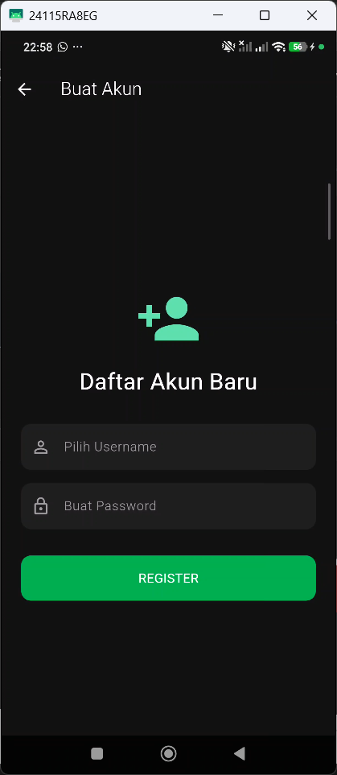
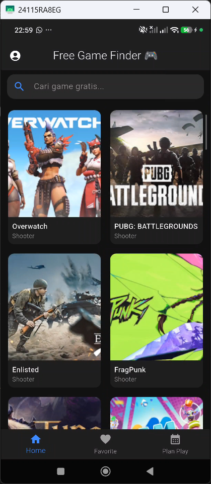
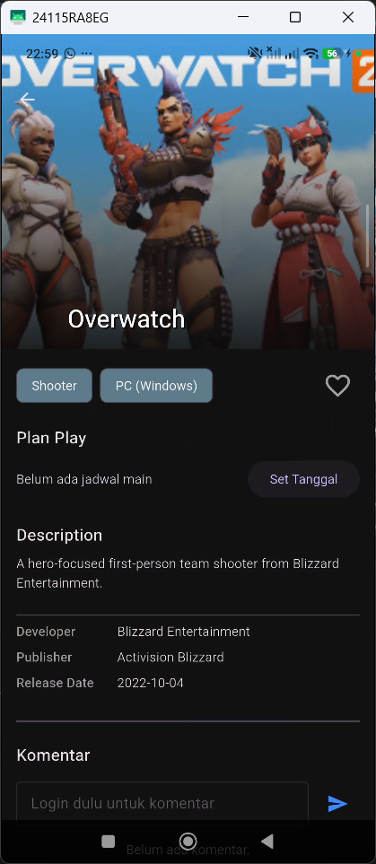
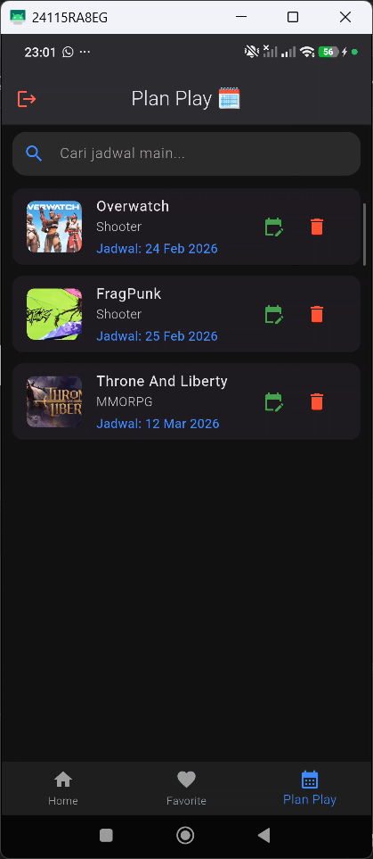
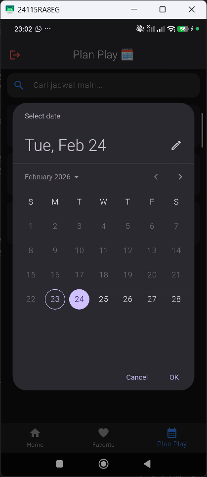
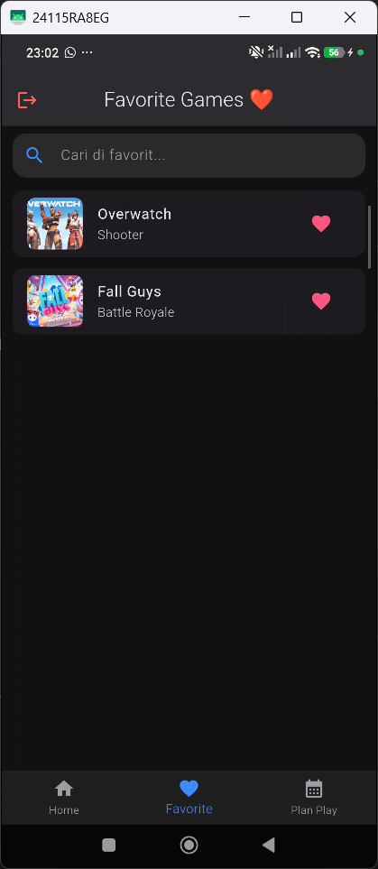
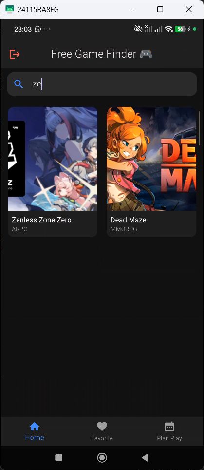

# Free Games Finder

Free Games Discovery & Play Planner App

## Deskripsi

**Free Games Finder** adalah aplikasi mobile yang dirancang khusus untuk para gamer guna menemukan informasi game gratis secara real-time dari berbagai platform. Aplikasi ini tidak hanya menyajikan daftar game, tetapi juga membantu pengguna mengelola jadwal bermain mereka.

Aplikasi ini menggunakan integrasi API eksternal untuk data game terbaru dan penyimpanan lokal (SQLite) untuk fitur personalisasi seperti daftar favorit dan penjadwalan main.

---

## Fitur

### Discovery & Search

* Menampilkan daftar game gratis terbaru (Home)
* Detail lengkap game (Deskripsi, Developer, Platform, Release Date)
* Pencarian game secara real-time berdasarkan judul
* Filter game berdasarkan kategori/genre

### Play Planner (Jadwal Main)

* Menambahkan game ke daftar jadwal main (Plan Play)
* Memilih tanggal bermain melalui Date Picker
* Mengedit tanggal jadwal yang sudah dibuat
* Menghapus jadwal main
* Mencari jadwal main berdasarkan judul game

### Favorite Management

* Menambahkan game ke daftar favorit
* Menghapus game dari favorit
* Mencari game di dalam daftar favorit

### Interaction & Auth

* Login & Register akun
* Memberikan ulasan/komentar pada setiap game
* Profil pengguna dan fitur Logout

---

## Tech Stack

* **Flutter** (Framework)
* **GetX** (State Management & Navigation)
* **SQLite / Sqflite** (Local Database)
* **Cached Network Image** (Image Caching)
* **Intl** (Date Formatting)

---

## Screenshot

### Login & Register

<p align="center">


</p>

### Home & Detail Game

<p align="center">


</p>

### Plan Play (Jadwal Main)

<p align="center">


</p>

### Favorites & Search

<p align="center">


</p>

---

## Cara Menjalankan

### 1️⃣ Clone Repository

```bash
git clone https://github.com/username/free_games_finder.git

```

### 2️⃣ Install Dependencies

```bash
flutter pub get

```

### 3️⃣ Jalankan Aplikasi

```bash
flutter run

```

---

## Video Presentasi

[(Link Video Presentasi)](https://drive.google.com/file/d/1ZFRuehQkGge0HmkFDlqGH0Ucvh_nPM0F/view?usp=sharing)


---

